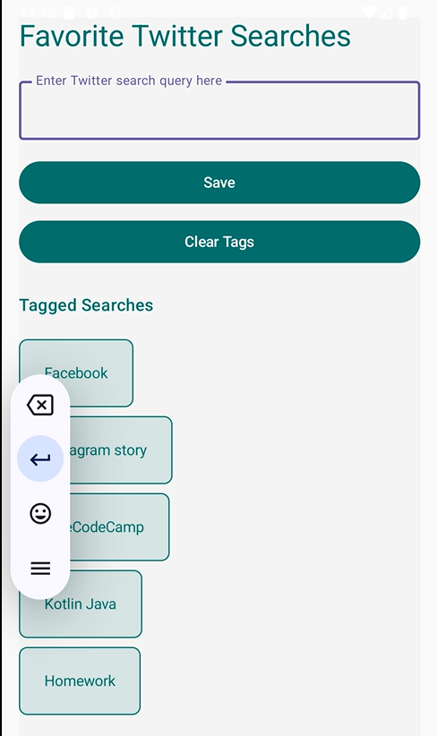

# Favorite Searches App

A simple Android app for saving favorite Twitter searches.

## Features
- Save favorite Twitter search queries.
- Tag and organize searches.
- Clear all tags with one click.

## Screenshot

## How to Use
1. Enter a search query in the input field.
2. Click "Save" to add it to your tagged searches.
3. Use "Clear Tags" to remove all saved searches.

## Demo
Here’s a screen recording of the app in action:

https://github.com/user-attachments/assets/b4381d1a-72b1-41a4-a8bc-99d2fbcb524b
