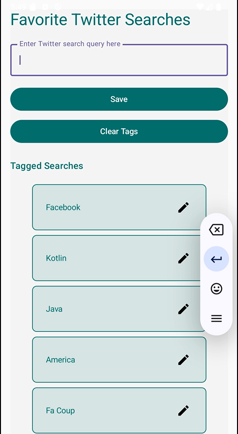

# Favorite Searches App

A simple Android app for saving and managing favorite Twitter searches.

## Features
- Save favorite Twitter search queries.
- Tag and organize searches.
- Filter tagged searches based on input query.
- Edit saved searches with an edit button.
- Clear all tags with one click.

## Screenshot

## How to Use
1. Enter a search query in the input field.
2. Click "Save" to add it to your tagged searches.
3. Use the filter functionality by typing in the search bar to filter tagged searches.
4. Click the edit button (✎) next to any tagged search to edit it.
5. Use "Clear Tags" to remove all saved searches.

## Demo
Here’s a screen recording of the app in action:

https://github.com/user-attachments/assets/bc9ce39d-202f-4318-b2b8-34ce6186cc53
